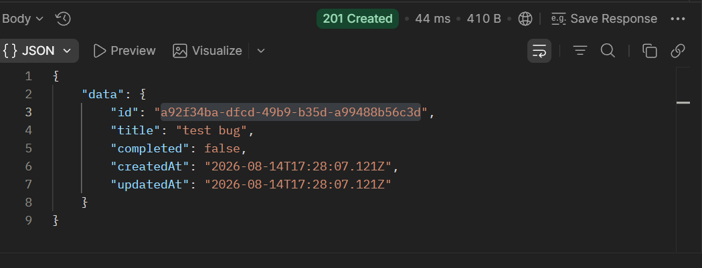
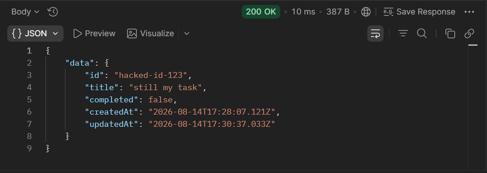
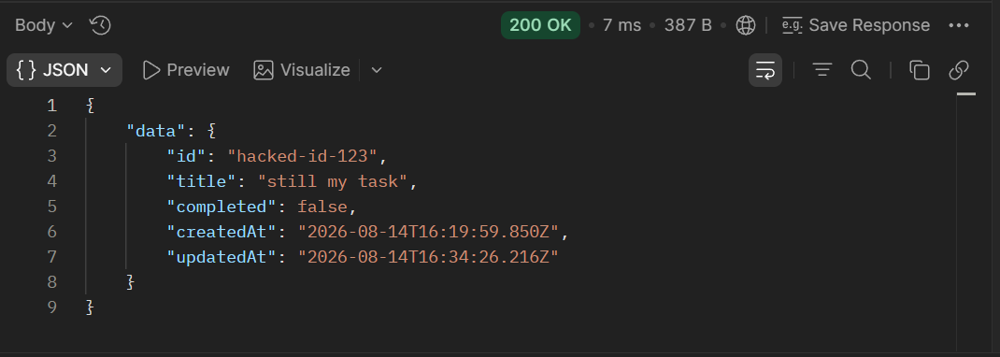
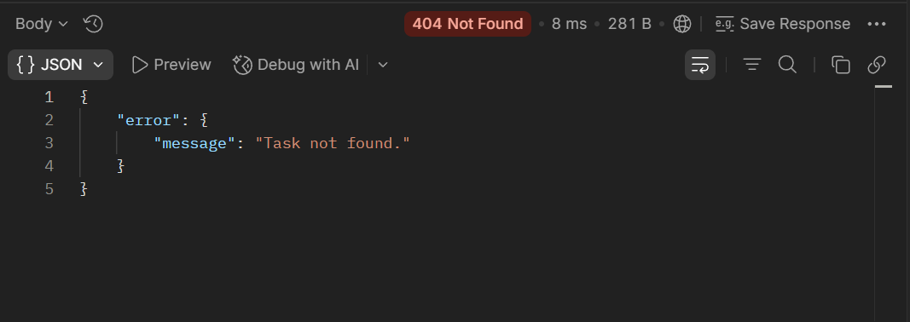

# Code Review — VeeLion Backend Assessment

This document covers the issues found while reviewing the Tasks API and Activity Log API, why each one matters, and how each was fixed and verified.

## Summary

| #   | Issue                                                                   | Category                      | Status   |
| --- | ----------------------------------------------------------------------- | ----------------------------- | -------- |
| 1   | PATCH `/tasks/:id` allows overwriting the task's `id`                   | Security / Bugs               | ✅ Fixed |
| 2   | Activity module: sync I/O, duplicate functions, no validation, weak IDs | Maintainability / Performance | ✅ Fixed |
| 3   | Read-modify-write race condition in `tasks.json` / `activity.json`      | Bugs                          | ✅ Fixed |
| 4   | Design decision: `status` field added to support Reports API            | Design decision               | ✅ Done  |
| 5   | New feature: Reports API (`GET /reports/tasks-summary`)                 | New feature                   | ✅ Done  |

---

## 1. PATCH `/tasks/:id` allows overwriting the task's `id`

**Category:** Security / Bugs

### What's wrong

The `PATCH` endpoint accepted any field in the request body and merged it directly onto the stored task — including `id`, which should never be client-controlled after a task is created.

### Why it's a problem

A client could silently change a task's identifier. This breaks anything that referenced the original id: the task becomes unreachable at its old id, and instead becomes reachable at whatever id the client chose to send.

### How I reproduced it (using Postman)

1. `POST /tasks` with body `{"title": "test bug"}` → returned a task with id `<original-id>`
   
2. `PATCH /tasks/<original-id>` with body `{"id": "hacked-id-123", "title": "still my task"}` → response showed the task's id had changed to `hacked-id-123`
   
3. `GET /tasks/hacked-id-123` → `200 OK`, the same task returned under the new id
   
4. `GET /tasks/<original-id>` → `404 Not Found` — the original id no longer resolved to anything
   

### Root cause

`tasks.service.js`'s `updateTask` merged the request body directly onto the existing record with `{ ...existingTask, ...updates }`, with no whitelist restricting which fields were allowed to change.

### Fix applied

Wired the existing (previously unused) `taskValidator.js` into `tasks.controller.js`. `validateCreateTask` and `validateUpdateTask` now run before the service is ever called, and `validateUpdateTask`'s `ensureNoUnknownFields` rejects any field outside `{ title, completed }` with a `400` before the request can reach the merge line. This also removed the redundant, inconsistent validation that used to live separately in the service.

### Verified

Re-ran the same PATCH request from step 2 — it now returns `400 Body contains unsupported fields` instead of succeeding. Confirmed a legitimate PATCH (`{"title": "new title"}`) still works normally.

---

## 2. Activity module: sync I/O, duplicate functions, no validation, weak IDs

**Category:** Maintainability / Performance

### What was wrong

`activity.service.js` had several compounding issues:

- Two identical functions, `loadDataA` and `loadDataB`, doing the exact same thing
- Blocking `fs.readFileSync` / `writeFileSync` calls instead of the async `jsonStore.js` utility already used by the Tasks module
- IDs generated with `Date.now()`, which risks collisions
- Zero request validation — `POST /activity` accepted any body, including an empty one

### Why it mattered

Synchronous file I/O blocks Node's single event loop, so every other in-flight request stalls during any activity read or write. `Date.now()` ids can collide if two records are created in the same millisecond. With no validation, broken records (e.g. `action: undefined`) could be written straight to disk.

### How I reproduced it

`POST /activity` with body `{}` returned `201` with `action`/`info` both `undefined`. Inspecting `activity.json` showed plain timestamp strings as ids, unlike the proper UUIDs used in `tasks.json`.

### Fix applied

- Created `activityValidator.js`, mirroring the existing `taskValidator.js` pattern (allow-list + type checks)
- Refactored `activity.service.js` to use the shared, async `jsonStore.js` instead of hand-rolled sync `fs` calls
- Switched id generation to `createId()` from `utils/id.js`, matching the Tasks module
- Wrapped both routes in `asyncHandler` and updated the controller to match the Tasks module's async/response-shape conventions

### Verified

`POST /activity` with `{}` now returns `400` instead of `201`. A valid POST now returns a UUID id instead of a timestamp string. `GET /activity` still returns the existing records correctly, now wrapped in `{ data: [...] }` to match the Tasks API's response shape.

---

## 3. Read-modify-write race condition in `tasks.json` / `activity.json`

**Category:** Bugs

### What was wrong

Every write followed a read-the-whole-file → modify in memory → write-the-whole-file pattern, with no locking. Two concurrent requests to the same file could interleave: the second request's read could happen before the first request's write finished, so the second write would overwrite the file using stale data — silently discarding the first request's change, even though that request received a `200 OK`.

### Why it mattered

This causes silent data loss with no error and no way for the client to know their update didn't actually persist — one of the more dangerous classes of bug, because everything _looks_ successful.

### How I reproduced it

Wrote a small script (`race-test.js`, not committed) that fires two `PATCH` requests to two different tasks at the same time using `Promise.all`. Both requests returned `200`, but one task's title reverted to its original value instead of reflecting the update — confirming the second write had overwritten the first request's change with stale data.

### Fix applied

Added `updateJsonArray()` to `jsonStore.js` — a per-file operation queue built on a `Map` of chained promises, so every read-modify-write cycle for a given file must fully complete before the next one for that same file can begin. Updated `createTask`/`updateTask`/`deleteTask` in `tasks.service.js` and `createNewActivity` in `activity.service.js` to use it instead of making separate `readJsonArray`/`writeJsonArray` calls.

### Verified

Re-ran the same concurrent-request script five times after the fix — both updates landed correctly every time.

---

## 4. Design decision: adding a `status` field to support the Reports API

**Category:** Design decision (not a bug)

### The gap I found

The Reports API spec (`GET /reports/tasks-summary`) requires `byStatus: { todo, in-progress, done }`, but the existing Task model only had a boolean `completed` field. A boolean can only represent two states, so there was no way to honestly produce a three-way breakdown from the data as it existed.

### Options I considered

1. **Fabricate an in-progress split** — e.g. guess that some percentage of incomplete tasks are "in-progress." Rejected: this invents data that was never actually recorded, which is worse than an honest gap.
2. **Report only `todo`/`done`, leave `in-progress` always 0** — technically simple, but doesn't fulfill the spirit of the requirement and hides the limitation rather than addressing it.
3. **Add a real `status` field to the Task model, migrate existing data as best as honestly possible** — chosen. This fixes the root problem (the data model itself) instead of working around it in the Reports layer.

### What I changed

- Added `status` (`'todo' | 'in-progress' | 'done'`) as the new source of truth for a task's state, validated by an enum check in `taskValidator.js`, exported as `STATUS_VALUES` so the Reports module can reuse the same list instead of hardcoding it again.
- Kept `completed` in every task response for backward compatibility, but it is now **derived**, not client-settable: `completed = (status === 'done')`. Nothing that reads `completed` breaks; nothing can set `status` and `completed` out of sync with each other.
- `ALLOWED_FIELDS` in `taskValidator.js` now allow-lists `status` instead of `completed` — a client can no longer set `completed` directly.

### Data migration

The three existing tasks only had `completed: true/false`, with no way to recover whether an incomplete task was truly untouched or actively in progress — that distinction was never captured by the old schema. Migrated conservatively:

- `completed: true` → `status: "done"`
- `completed: false` → `status: "todo"` (never guessed `"in-progress"`, since there was no evidence for it)

### Verified

- `GET /tasks` — all 3 migrated tasks show matching `status`/`completed` pairs.
- `POST /tasks` with no `status` given — defaults to `status: "todo"`, `completed: false`.
- `PATCH` a task to `status: "in-progress"` — `completed` correctly stays `false` (only `"done"` maps to `true`).
- `PATCH` the same task to `status: "done"` — `completed` correctly flips to `true`.

---

## 5. New feature: Reports API (`GET /reports/tasks-summary`)

**Category:** New feature

### What it does

Returns an aggregated summary of the system's data:

```json
{
  "data": {
    "total": 3,
    "byStatus": { "todo": 1, "in-progress": 0, "done": 2 },
    "recentActivityCount": 3
  }
}
```

### Design

Created a new `reports` module, structured the same way as `tasks` and `activity` (`routes/` → `controllers/` → `services/`), so the codebase stays consistent and predictable.

The key architectural decision: `reports.service.js` does **not** read `tasks.json` or `activity.json` directly. It calls the existing `tasksService.getAllTasks()` and `activityService.getAllActivity()` functions instead — composing existing business logic rather than duplicating file-reading code a third time. The two reads run concurrently via `Promise.all`, since they're unrelated to each other.

`byStatus` is seeded from `taskValidator.js`'s exported `STATUS_VALUES` list rather than hardcoding `'todo'`/`'in-progress'`/`'done'` again — if a status is ever added or renamed, this file doesn't need to change.

### Open ambiguity I resolved

The README's example response doesn't define what counts as "recent" for `recentActivityCount`. Rather than inventing a time window (e.g. "last 24 hours") with no basis in the spec, I defined it as the count of the most recent 10 activity entries, capped with `Math.min(activity.length, 10)` so it never overreports when there are fewer than 10 entries total.

### Verified

- `GET /reports/tasks-summary` returns correct, live-calculated numbers matching the actual contents of `tasks.json` and `activity.json`.
- Created additional tasks with different statuses and re-ran the request — counts updated correctly each time, confirming the aggregation isn't cached or hardcoded.
